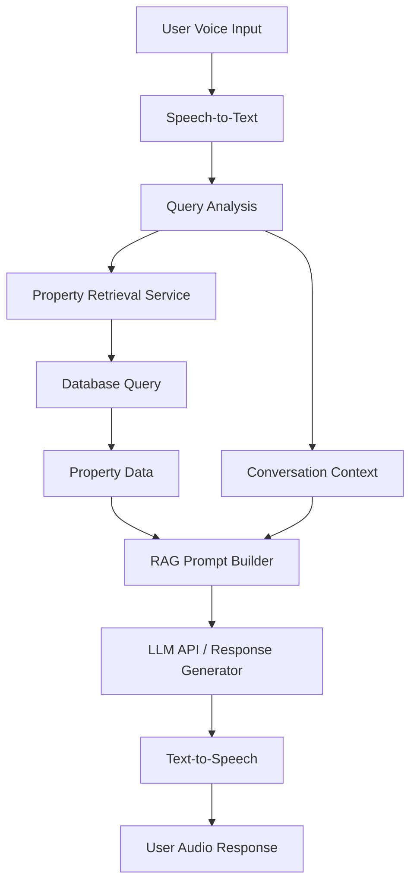
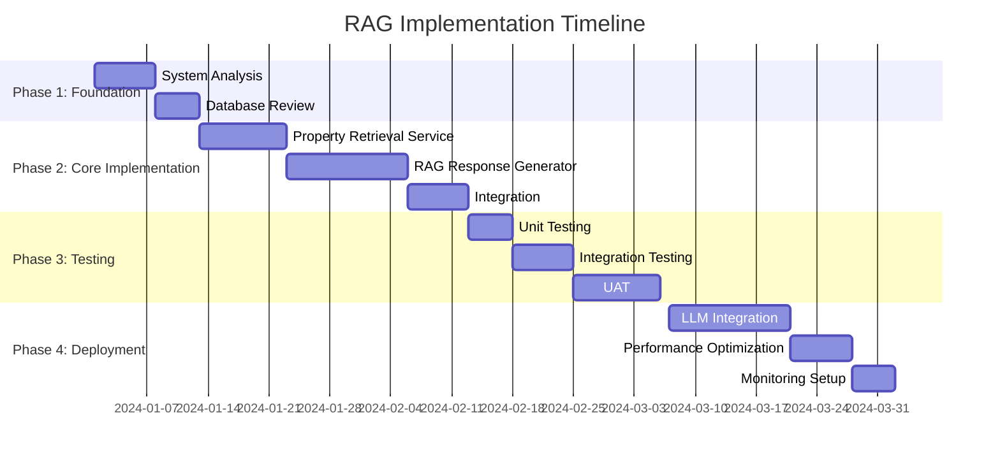

# RAG-based AI Agent Implementation Plan

## Executive Summary

This document outlines a comprehensive plan to implement a Retrieval-Augmented Generation (RAG) system for the AI agent CRM calling feature. The current system uses mock responses, while the proposed RAG system will retrieve actual property data from the database and generate contextually rich, accurate responses.

## Current System Analysis

### Current Architecture

1. **Database Schema**: SQLite with key tables:
   - `aiAgents`: Stores AI agent configurations
   - `callLogs`: Stores call transcripts and metadata  
   - `properties`: Contains property listings with details
   - `users`: Stores user information

2. **Call Flow**:
   - User initiates call via `VoiceCallWidget`
   - Frontend connects to Socket.IO server (`/calls` namespace)
   - `StartCall` API creates call log entry
   - Voice input → Web Speech API → WebSocket transmission
   - `ProcessVoiceInput` event generates response
   - AI response sent back via WebSocket → Text-to-Speech

3. **Current Limitations**:
   - Uses `generateMockResponse()` with hardcoded templates
   - No database integration for property data
   - Generic responses regardless of actual inventory
   - Limited context and personalization

## Proposed RAG System Architecture

### RAG Components



### Key Components

1. **Property Retrieval Service** (`property-retriever.ts`)
   - Parses user queries to extract filters (location, price, bedrooms, etc.)
   - Executes dynamic database queries
   - Returns structured property data

2. **RAG Response Generator** (`rag-agent.ts`)
   - Builds context-augmented prompts
   - Integrates property data with conversation history
   - Generates specific, data-driven responses

3. **Enhanced Call Processing** (Updated `08-calls-process.step.ts`)
   - Replaces mock responses with RAG-based generation
   - Maintains existing WebSocket communication
   - Preserves call logging and transcript functionality

## Implementation Roadmap

### Phase 1: Foundation (Completed)

✅ **1.1 System Analysis**
- Analyze current AI agent CRM implementation
- Document call flow and data structures
- Identify integration points

✅ **1.2 Database Schema Review**
- Review `properties` table structure
- Identify queryable fields and relationships
- Document data formats (JSON fields, etc.)

✅ **1.3 Current Response Mechanism Documentation**
- Document `generateMockResponse()` functionality
- Identify response patterns and templates
- Map user intents to response types

### Phase 2: Core RAG Implementation (Completed)

✅ **2.1 Property Retrieval Service**
- Create `property-retriever.ts` with query parsing
- Implement dynamic database queries
- Add property data formatting

✅ **2.2 RAG Response Generator**
- Create `rag-agent.ts` with prompt building
- Implement context-augmented response generation
- Add fallback mechanisms

✅ **2.3 Integration with Call Processing**
- Update `08-calls-process.step.ts` to use RAG
- Replace mock responses with RAG-based generation
- Maintain backward compatibility

### Phase 3: Testing & Validation

🔄 **3.1 Unit Testing**
- Test property retrieval with various queries
- Validate response generation accuracy
- Test edge cases and error handling

🔄 **3.2 Integration Testing**
- Test complete call flow with RAG responses
- Validate WebSocket communication
- Test database query performance

🔄 **3.3 User Acceptance Testing**
- Test with sample property data
- Validate response quality and relevance
- Gather feedback for improvements

### Phase 4: Production Deployment

🚀 **4.1 LLM Integration**
- Replace enhanced mock with actual LLM API calls
- Configure API keys and rate limiting
- Implement caching for frequent queries

🚀 **4.2 Performance Optimization**
- Add query caching layer
- Implement database indexing
- Optimize response generation

🚀 **4.3 Monitoring & Analytics**
- Add response quality metrics
- Implement usage tracking
- Set up error monitoring

## Technical Implementation Details

### Property Retrieval Service

```typescript
// Key Functions
- retrievePropertiesForQuery(query: string, limit: number): Promise<any[]>
- extractLocationFromQuery(query: string): string | null
- extractMinPriceFromQuery(query: string): number | null
- extractMaxPriceFromQuery(query: string): number | null
- extractMinBedroomsFromQuery(query: string): number | null
- extractPropertyTypeFromQuery(query: string): string | null
- formatPropertiesForContext(properties: any[]): string
```

### RAG Response Generator

```typescript
// Key Functions
- generateRagResponse(systemPrompt: string, userMessage: string, agentName: string, conversationHistory: any[]): Promise<string>
- buildRagPrompt(systemPrompt: string, userMessage: string, agentName: string, propertyContext: string, conversationHistory: any[]): string
- generateEnhancedResponse(prompt: string, userMessage: string, properties: any[], agentName: string): string
```

### Integration Points

**Updated Call Processing Flow:**
```typescript
// Before (Mock Response)
const responseText = generateMockResponse(agent.systemPrompt, text, agent.name);

// After (RAG Response)
const responseText = await generateRagResponse(
    agent.systemPrompt, 
    text, 
    agent.name, 
    conversationHistory
);
```

## Example User Journey with RAG

### Scenario: User Asks About 3-Bedroom Properties in Miami

**User Input**: "What 3 bedroom properties do you have in Miami?"

**Current System Response**:
> "For bedrooms, we have options ranging from cozy studios to spacious 5-bedroom homes. How many bedrooms would work best for your needs?"

**RAG System Response**:
> "Based on your criteria, here are some options: Luxury Villa - $1,200,000 (3 bed, 2 bath); Downtown Condo - $850,000 (3 bed, 2 bath). These properties range from $850,000 to $1,200,000. Would you like more details on any specific property?"

## Benefits of RAG Implementation

### 1. **Improved Accuracy**
- Responses based on actual property data
- Specific prices, locations, and features
- Reduced generic template responses

### 2. **Enhanced User Experience**
- Personalized, context-aware responses
- Direct answers to specific property questions
- Better conversion rates through relevant information

### 3. **Business Value**
- Increased user engagement
- Higher quality leads
- Competitive differentiation
- Reduced manual agent workload

### 4. **Scalability**
- Handles diverse property inventory
- Adapts to changing market conditions
- Supports multiple agents and sellers

## Risk Assessment & Mitigation

### Risks

1. **Performance Impact**: Database queries may slow response times
2. **Data Quality**: Incomplete property data affects response quality
3. **Integration Complexity**: Changes to existing call flow
4. **User Expectations**: Transition from generic to specific responses

### Mitigation Strategies

1. **Performance**: Implement caching, optimize queries, add loading states
2. **Data Quality**: Validate property data, add fallbacks, implement data cleaning
3. **Integration**: Maintain backward compatibility, thorough testing, phased rollout
4. **User Experience**: Clear communication about improved capabilities, gradual enhancement

## Success Metrics

### Quantitative Metrics
- **Response Accuracy**: % of responses containing actual property data
- **User Engagement**: Increase in call duration and interactions
- **Conversion Rate**: % of calls leading to property tours or inquiries
- **Response Time**: Average time to generate RAG responses (< 2s target)

### Qualitative Metrics
- **User Satisfaction**: Feedback on response relevance and helpfulness
- **Agent Performance**: Reduction in manual intervention needed
- **Business Impact**: Increase in qualified leads and sales

## Future Enhancements

### Short-Term (3-6 months)
- **LLM Integration**: Replace mock with actual LLM API calls
- **Vector Search**: Implement semantic search for better property matching
- **User Preferences**: Store and utilize user preferences across calls

### Medium-Term (6-12 months)
- **Multimodal Responses**: Add image/video property previews
- **Advanced Analytics**: Track response effectiveness and user behavior
- **Multi-language Support**: Expand to additional languages

### Long-Term (12+ months)
- **Predictive Recommendations**: AI-driven property suggestions
- **Virtual Tours**: Integrated 3D property walkthroughs
- **Transaction Assistance**: AI-assisted purchase processes

## Implementation Timeline



## Conclusion

The RAG-based AI agent implementation represents a significant enhancement to the current CRM calling system. By integrating actual property data retrieval with advanced response generation, the system will provide more accurate, helpful, and engaging interactions for users. This implementation aligns with the platform's goal of creating a comprehensive, AI-powered real estate CRM system that delivers real business value.

The phased approach ensures minimal disruption to existing functionality while gradually introducing enhanced capabilities. With proper testing, monitoring, and continuous improvement, the RAG system will become a key differentiator in the competitive real estate market.

## Next Steps

1. **Complete Testing**: Finalize unit and integration testing
2. **Performance Benchmarking**: Establish baseline metrics
3. **Stakeholder Review**: Present implementation plan for approval
4. **Phased Rollout**: Begin with internal testing, then beta users
5. **Monitor & Iterate**: Continuously improve based on real-world usage

**Status**: Implementation plan complete and ready for review
**Next Action**: Stakeholder approval and testing commencement