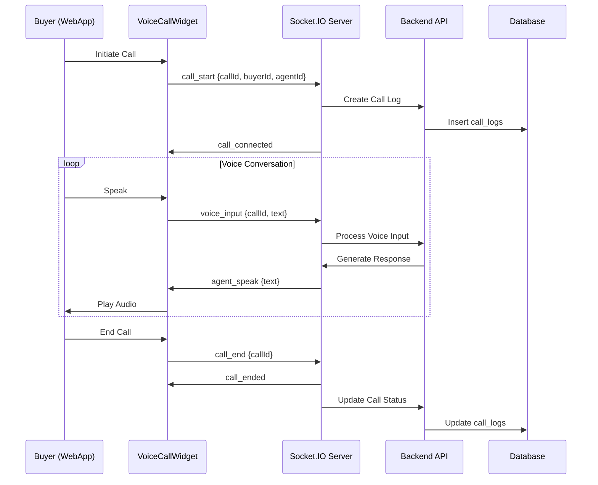

# PropertyHub - Real Estate Trading Platform

**A full-stack web platform for buying and selling properties, inspired by Amazon/eBay but tailored for real estate with a built-in CRM system for sellers.**

---

## **Current Implementation Status**

### ✅ Implemented Features
- **Authentication System**: User registration with email/password using JWT
- **User Roles**: Buyer, Seller, Agent roles with proper validation and role-based access control
- **Property Management**: Complete CRUD operations for property listings with validation
- **Property Search**: Advanced filtering by price, type, bedrooms, location, and amenities
- **Cart System**: Buyers can add properties to cart for agent contact with notes functionality
- **CRM Agent Hiring**: Sellers can hire human agents with subscription plans and performance tracking
- **AI Agent Management**: Complete CRUD operations for AI agents (create, read, update, delete) with voice configuration
- **AI Agent Purchase System**: Sellers can hire AI agents with subscription plans (monthly, quarterly, yearly) with tiered pricing
- **AI Agent Termination**: Sellers can terminate AI agent subscriptions with prorated refunds and proper lifecycle management
- **Realtime Voice Call CRM**: WebSocket-based voice call system with call management, signaling, and room-based communication
- **Call Processing**: Complete voice input/output signaling with real-time transcript recording and storage
- **Mock Payment System**: Complete payment processing simulation with card validation, transaction recording, and subscription management
- **Subscription Management**: Full subscription lifecycle management for both AI and human agents with billing cycles
- **Analytics Dashboard**: Seller analytics with property views, inquiries, lead tracking, and conversion metrics
- **Unified Agent Management**: Single system for both AI and human agents with unified lead assignment and subscription validation
- **Lead Assignment System**: Unified lead assignment for both AI and human agents with subscription validation and performance tracking

### ⏳ Partially Implemented Features
- **Database**: SQLite (development, planned migration to PostgreSQL for production)
- **Authentication**: Basic JWT (OAuth integration with Google, Facebook, Apple pending)
- **CRM System**: Basic lead management (advanced features like commission tracking and call logs pending)
- **Voice Integration**: WebSocket infrastructure complete, but actual TTS/STT integration with providers like ElevenLabs pending
- **Frontend UI**: Next.js frontend with TailwindCSS setup, but many pages need implementation

### ❌ Missing Features (To Be Implemented)
- **Advanced Search**: No Elasticsearch integration for fast, scalable property search
- **Real-Time Updates**: No WebSocket implementation for chat/notifications (voice calls implemented)
- **Payment Gateway**: No Stripe integration (mock payment system implemented)
- **File Storage**: No AWS S3 integration for property images and documents
- **Maps Integration**: No Google Maps/Mapbox integration for location-based search and property visualization
- **Virtual Tours**: No 3D/AR virtual tour integration
- **Digital Contracts**: No DocuSign or similar integration for legal documents
- **Auction System**: No auction mode for high-demand properties
- **Mortgage Calculator**: No mortgage calculation with bank API integration
- **Neighborhood Insights**: No integration with external data sources for neighborhood information

---

## **Tech Stack**

### Current Implementation

## **Comprehensive System Architecture**

### **System Architecture Overview**

The PropertyHub system follows a modern, layered architecture with clear separation of concerns:

```mermaid
graph TD
    %% ============================================
    %% CLIENT LAYER
    %% ============================================
    subgraph ClientLayer[Client Layer]
        direction TB
        WebApp[Next.js Web Application] -->|HTTP| BackendAPI
        MobileApp[Mobile App - Future] -->|HTTP| BackendAPI
        
        WebApp -->|WebSocket| SocketServer
        MobileApp -->|WebSocket| SocketServer
        
        subgraph WebComponents[Web Components]
            AuthContext[Auth Context] -->|Manages| UserSession
            VoiceCallWidget[Voice Call Widget] -->|WebSocket| SocketServer
            PropertyGrid[Property Grid] -->|REST| BackendAPI
            CartSystem[Cart System] -->|REST| BackendAPI
            Dashboard[CRM Dashboard] -->|REST| BackendAPI
        end
    end

    %% ============================================
    %% BACKEND LAYER
    %% ============================================
    subgraph BackendLayer[Backend Layer]
        direction TB
        
        subgraph MOTIAFramework[MOTIA Framework]
            BackendAPI[REST API Endpoints] -->|Drizzle ORM| Database
            BackendAPI -->|JWT Auth| AuthService
            BackendAPI -->|Validation| ZodValidation
            
            subgraph APIEndpoints[API Endpoints]
                AuthAPI[Authentication API] -->|JWT| AuthService
                PropertiesAPI[Properties API] -->|CRUD| Database
                CartAPI[Cart API] -->|CRUD| Database
                CRMAPI[CRM API] -->|CRUD| Database
                AIAgentsAPI[AI Agents API] -->|CRUD| Database
                CallsAPI[Calls API] -->|CRUD| Database
                SubscriptionsAPI[Subscriptions API] -->|CRUD| Database
                AnalyticsAPI[Analytics API] -->|CRUD| Database
            end
        end
        
        SocketServer[Socket.IO Server] -->|Real-time| CallSessions
        SocketServer -->|Events| BackendAPI
        
        subgraph Services[Backend Services]
            AuthService[JWT Authentication] -->|Verify| Database
            SocketServer -->|Call Management| CallSessions
            VoiceBridge[Voice Bridge] -->|Process| CallSessions
            MockPayment[Mock Payment Service] -->|Process| Database
        end
    end

    %% ============================================
    %% DATABASE LAYER
    %% ============================================
    subgraph DatabaseLayer[Database Layer]
        direction TB
        Database[SQLite/PostgreSQL] -->|Drizzle ORM| Schema
        
        subgraph Schema[Database Schema]
            UsersTable[users] -->|1:N| PropertiesTable
            UsersTable -->|1:N| CartTable
            UsersTable -->|1:N| LeadsTable
            UsersTable -->|1:N| AgentAssignments
            UsersTable -->|1:N| AiAgentsTable
            UsersTable -->|1:N| SubscriptionsTable
            UsersTable -->|1:N| TransactionsTable
            UsersTable -->|1:N| CallLogsTable
            
            PropertiesTable[properties] -->|1:N| CartTable
            PropertiesTable -->|1:N| LeadsTable
            
            AiAgentsTable[ai_agents] -->|1:N| SubscriptionsTable
            AiAgentsTable -->|1:N| CallLogsTable
            
            SubscriptionsTable[subscriptions] -->|1:N| TransactionsTable
            
            CallLogsTable[call_logs] -->|1:N| Transcripts
        end
        
        CallSessions[Active Call Sessions] -->|In-Memory| SocketServer
    end

    %% ============================================
    %% EXTERNAL SERVICES
    %% ============================================
    subgraph ExternalServices[External Services]
        direction TB
        Stripe[Stripe Payment Gateway] -->|Future| MockPayment
        ElevenLabs[ElevenLabs TTS] -->|Future| VoiceBridge
        GoogleTTS[Google TTS] -->|Future| VoiceBridge
        GoogleMaps[Google Maps API] -->|Future| PropertiesAPI
        Elasticsearch[Elasticsearch] -->|Future| PropertiesAPI
    end

    %% ============================================
    %% DATA FLOW CONNECTIONS
    %% ============================================
    WebApp -->|1. User Registration| AuthAPI
    WebApp -->|2. Property Search| PropertiesAPI
    WebApp -->|3. Add to Cart| CartAPI
    WebApp -->|4. Hire AI Agent| AIAgentsAPI
    WebApp -->|5. Start Voice Call| CallsAPI
    
    CallsAPI -->|6. Create Call Log| Database
    SocketServer -->|7. Real-time Events| VoiceCallWidget
    VoiceBridge -->|8. Process Voice Input| SocketServer
    
    %% WebSocket Events
    VoiceCallWidget -->|call_start| SocketServer
    VoiceCallWidget -->|voice_input| SocketServer
    VoiceCallWidget -->|call_end| SocketServer
    
    SocketServer -->|call_connected| VoiceCallWidget
    SocketServer -->|agent_speak| VoiceCallWidget
    SocketServer -->|call_ended| VoiceCallWidget

    %% ============================================
    %% STYLES
    %% ============================================
    style ClientLayer fill:#f9f9f9,stroke:#333,stroke-width:2px
    style BackendLayer fill:#f0f8ff,stroke:#333,stroke-width:2px
    style DatabaseLayer fill:#fff0f0,stroke:#333,stroke-width:2px
    style ExternalServices fill:#f0fff0,stroke:#333,stroke-width:2px
    
    style WebApp fill:#e6f7ff,stroke:#4da6ff
    style MobileApp fill:#e6f7ff,stroke:#4da6ff
    style BackendAPI fill:#fff2e6,stroke:#ffa940
    style SocketServer fill:#f0fff4,stroke:#7cb342
    style Database fill:#fff0e6,stroke:#ff8c00
```

### **Layered Architecture Breakdown**

#### **1. Client Layer**
- **Next.js Web Application**: Primary user interface with React 19.2.3
- **Mobile App**: Future React Native implementation
- **Key Components**: AuthContext, VoiceCallWidget, PropertyGrid, CartSystem, Dashboard
- **Communication**: HTTP REST API + WebSocket real-time communication

#### **2. Backend Layer**
- **MOTIA Framework**: Node.js-based framework with TypeScript
- **API Endpoints**: 24+ RESTful endpoints across 8 functional areas
- **WebSocket Server**: Socket.IO for real-time voice call CRM
- **Services**: JWT Authentication, Voice Bridge, Mock Payment, Call Session Management

#### **3. Database Layer**
- **Current**: SQLite with Drizzle ORM
- **Production**: PostgreSQL planned
- **Schema**: 10 tables with proper relationships
- **In-Memory**: Active call sessions for real-time performance

#### **4. External Services**
- **Payment**: Stripe (planned, currently mock implementation)
- **TTS/STT**: ElevenLabs, Google TTS (planned)
- **Maps**: Google Maps API (planned)
- **Search**: Elasticsearch (planned)
- **Storage**: AWS S3 (planned)

### **Real-time Communication Architecture**

The system features an innovative WebSocket-based voice call CRM that enables real-time communication between buyers and AI agents:

### **Key Architectural Features**

#### **Unified Agent Management**
- Single system for both AI and human agents
- Consistent data model and API interface
- Subscription-based hiring with tiered pricing
- Performance tracking and lead assignment

#### **Event-Driven Architecture**
- MOTIA framework's built-in event system
- Topic-based event emits for decoupled processing
- Real-time event handling for voice calls
- Scalable event processing pipeline

#### **Subscription-Based Monetization**
- Tiered pricing (monthly, quarterly, yearly)
- Prorated refunds for early termination
- Complete subscription lifecycle management
- Mock payment system with real Stripe integration planned

#### **Real-time Voice CRM**
- WebSocket-based communication
- Room-based call isolation
- Call session management
- Transcript recording and storage
- Voice input/output signaling

### **Database Schema Architecture**

The system uses a relational database with 10 core tables:

**Core Entities:**
- `users`: User accounts with roles (buyer, seller, agent)
- `properties`: Property listings with metadata
- `carts`: Buyer's property shortlist
- `leads`: Buyer inquiries and lead tracking

**Agent Management:**
- `agent_assignments`: Human agent assignments
- `ai_agents`: AI agent configurations with voice settings
- `subscriptions`: Agent subscriptions with billing cycles
- `transactions`: Payment events and refunds

**Call Management:**
- `call_logs`: Voice call records with transcripts

**Key Relationships:**
- Users → Properties (1:N)
- Users → Cart Items (1:N)
- Users → Leads (1:N)
- Users → Agent Assignments (1:N)
- Users → AI Agents (1:N)
- Users → Subscriptions (1:N)
- Users → Transactions (1:N)
- Users → Call Logs (1:N)

### **Technology Stack Summary**

**Frontend:**
- Framework: Next.js 16.1.1
- Language: TypeScript
- UI: TailwindCSS, Framer Motion
- State: React Context API
- Real-time: Socket.IO Client

**Backend:**
- Framework: MOTIA (Node.js-based)
- Language: TypeScript
- Database: SQLite (dev) / PostgreSQL (prod)
- ORM: Drizzle ORM
- Validation: Zod
- Real-time: Socket.IO Server
- Auth: JWT

**External Services (Planned):**
- Payments: Stripe
- TTS/STT: ElevenLabs, Google TTS
- Maps: Google Maps API
- Search: Elasticsearch
- Storage: AWS S3

### **Future Architecture Evolution**

**Phase 1: Production Readiness**
- Database migration to PostgreSQL
- Real payment integration (Stripe)
- Voice provider integration (ElevenLabs/Google TTS)
- Production monitoring and logging

**Phase 2: Scalability Enhancements**
- Redis caching implementation
- Load balancing for API servers
- Multiple WebSocket servers with Redis pub/sub
- CDN for static assets

**Phase 3: Advanced Features**
- Elasticsearch integration for property search
- Google Maps API for location services
- AWS S3 for file storage
- Microservices decomposition

**Phase 4: Enterprise Features**
- Multi-region deployment
- Advanced analytics pipeline
- Machine learning for recommendations
- AI-powered features

### **Architectural Strengths**

1. **Modular Design**: Clear separation of client, backend, and database layers
2. **Real-time Capabilities**: WebSocket-based voice CRM for instant communication
3. **Unified Agent System**: Single interface for AI and human agents
4. **Event-Driven**: Scalable event processing architecture
5. **Type Safety**: TypeScript throughout the stack with Drizzle ORM
6. **Validation**: Comprehensive Zod validation for all inputs
7. **Extensible**: Designed for easy addition of new features
8. **Production-Ready Foundation**: Solid architecture for commercial deployment

### **Architectural Considerations**

**Current Limitations:**
- SQLite database not suitable for production
- Mock payment system needs Stripe integration
- No TTS/STT provider integration yet
- Basic authentication without OAuth

**Scalability Considerations:**
- WebSocket server scaling with Redis pub/sub
- Database connection pooling for PostgreSQL
- Load balancing for API servers
- Caching strategy for frequent queries

**Security Considerations:**
- JWT token security and expiration
- WebSocket authentication and authorization
- Input validation and sanitization
- Rate limiting for API endpoints

## **Conclusion**

The PropertyHub system architecture represents a modern, scalable real estate platform with innovative AI-powered voice CRM capabilities. The layered architecture provides clear separation of concerns while enabling real-time communication through WebSocket technology. The unified agent management system and subscription-based monetization model create a unique value proposition in the real estate market.

The architecture is designed for evolution, with clear paths for production deployment, scalability enhancements, and advanced feature integration. This comprehensive system architecture provides the technical foundation for PropertyHub's vision of revolutionizing real estate transactions through AI-powered automation and real-time communication.
- **Backend:** MOTIA (Node.js-based framework) with TypeScript
- **Database:** SQLite (development) with Drizzle ORM
- **Validation:** Zod schema validation for all API endpoints
- **ORM:** Drizzle ORM for type-safe database operations
- **WebSockets:** Socket.io for real-time voice call CRM
- **API Design:** RESTful API with proper error handling and logging

### Planned Technologies
- **Frontend:** Next.js 16.1.1 (React-based, SSR/SSG for SEO & performance)
- **Database:** PostgreSQL (relational) + Redis (caching)
- **Authentication:** JWT + OAuth (Google, Facebook, Apple)
- **Payment Gateway:** Stripe (agent subscriptions & transactions)
- **Search:** Elasticsearch (fast property filtering)
- **Real-Time Updates:** WebSockets (notifications, chat, live bidding)
- **File Storage:** AWS S3 (property images, videos, documents)
- **Maps & Geolocation:** Google Maps API / Mapbox
- **Voice Integration:** ElevenLabs/Google TTS for AI voice calls
- **UI Framework:** TailwindCSS with Framer Motion for animations

---

## **Core Features & Workflow**

### **A. User Roles & Authentication**

#### **1. Buyer** ✅ Partially Implemented
- ✅ Signup/Login (Email, Password)
- ✅ Browse properties (filters: price, location, type, amenities)
- ✅ Add to "Cart" (shortlist for agent contact)
- ❌ Schedule visits (via agent or self-service) - Not implemented
- ❌ Chat with agents/sellers - No WebSocket implementation
- ❌ Virtual tours (3D/AR integration) - Not implemented

#### **2. Seller (Individual/Organization)** ✅ Partially Implemented
- ✅ Signup/Login (Basic authentication)
- ✅ **CRM Dashboard** (Basic property and lead management)
- ✅ **Agent Management System** (Hire human agents)
- ✅ Property listing (form-based upload with validation)
- ✅ Analytics (views, inquiries, conversion rates)
- ❌ Subscription-based agent hiring (Stripe integration) - No payment processing
- ❌ KYC verification for organizations - Not implemented

#### **3. Agent (Seller's Employee or Platform Agent)** ✅ Partially Implemented
- ✅ Assigned to sellers (subscription model)
- ✅ Lead management (basic tracking)
- ❌ Commission tracking - Not implemented
- ❌ Chat/Call logs (integrated with CRM) - No voice call system

#### **4. Admin (Platform Moderator)** ❌ Not Implemented
- ❌ Approve/reject listings - No admin interface
- ❌ Dispute resolution - Not implemented
- ❌ Analytics (platform-wide performance) - Only seller-level analytics

#### **5. AI Agent (New Role)** ✅ FULLY IMPLEMENTED
- ✅ AI Agent Management (CRUD operations with voice configuration)
- ✅ Voice configuration storage (JSON-based voice settings)
- ✅ AI Agent Purchase System - Complete subscription/payment system with tiered pricing
- ✅ Realtime Voice Call CRM - Full WebSocket and voice integration with call signaling
- ✅ Lead assignment to AI agents - Fully integrated with CRM and subscription validation
- ✅ Call transcript recording and storage - Complete call logging system

---

### **B. Key Functionalities**

#### **1. Property Listing & Search** ✅ Partially Implemented
- ✅ **Structured Form for Sellers** (Basic fields implemented):
  - ✅ Property type (House, Apartment, Land, Commercial)
  - ✅ Location (Basic address fields, no Maps API)
  - ✅ Price, size, bedrooms, bathrooms, amenities
  - ❌ High-quality images (AI-enhanced uploads) - Basic image URLs only
  - ❌ Virtual tour (360° images/AR walkthrough) - Not implemented
  - ❌ Legal documents (verification badge) - Not implemented

- ❌ **Advanced Search Filters** - Basic filtering only:
  - ✅ Price range, property type, bedrooms
  - ❌ Location radius search - No geospatial queries
  - ❌ AI-powered recommendations - Not implemented
  - ❌ Saved searches - Not implemented

#### **2. Buyer's Cart & Agent Assignment** ✅ Partially Implemented
- ✅ **Cart System** (Basic implementation):
  - ✅ Buyer adds properties to cart → Seller gets notified
  - ✅ Lead creation for seller
  - ❌ **Automated Cron-Based Assignment** - No cron job implementation
  - ❌ Agent calls buyer - No voice call system
  - ❌ Platform agent assistance - No platform agents

#### **3. CRM for Sellers** ✅ Partially Implemented
- ✅ **Agent Management** (Basic human agent hiring):
  - ✅ Hire agents (subscription model)
  - ❌ Assign leads manually/auto - No lead assignment logic
  - ❌ Track agent performance - Basic tracking only
- ✅ **Lead Tracking** (Basic implementation):
  - ✅ Buyer inquiries (database tracking)
  - ❌ Chat/Call logs - No communication system
  - ❌ Appointment scheduling - Not implemented
- ✅ **Analytics Dashboard** (Basic analytics):
  - ✅ Property views, inquiries tracking
  - ❌ Conversion rates - Basic calculation only

#### **4. Real-Time Communication** ✅ PARTIALLY IMPLEMENTED
- ✅ **WebSocket-Based Voice Call CRM** - Complete infrastructure for voice calls
- ✅ Buyer ↔ AI Agent communication via WebSocket signaling
- ✅ Real-time call management with room-based communication
- ✅ Call transcript recording and streaming
- ❌ WebSocket-Based Chat - No messaging infrastructure
- ❌ File sharing functionality - Not implemented
- ❌ Video Call Integration - Not implemented

#### **5. Transaction & Legal Workflow** ❌ Not Implemented
- ❌ **Escrow System** - No payment processing
- ❌ **Digital Contracts** - No DocuSign integration
- ❌ **Legal Verification** - No document checks

#### **6. Unique Features (Competitive Edge)** ❌ Not Implemented
- ❌ **AI-Powered Valuation Tool** - Not implemented
- ❌ **AR/VR Property Tours** - Not implemented
- ❌ **Auction Mode** - Not implemented
- ❌ **Mortgage Calculator** - Not implemented
- ❌ **Neighborhood Insights** - Not implemented

#### **7. AI Agent System** ✅ FULLY IMPLEMENTED
- ✅ **AI Agent Management**:
  - ✅ CRUD operations (Create, Read, Update, Delete) with Zod validation
  - ✅ Voice configuration storage (JSON-based settings for TTS/STT)
  - ✅ AI Agent Purchase System - Complete subscription/payment system with tiered pricing
  - ✅ Realtime Voice Call CRM - Full WebSocket and voice integration with Socket.io
  - ✅ Lead assignment to AI agents - Fully integrated with CRM and subscription validation
  - ✅ Call transcript recording and storage - Complete call logging system
  - ✅ Subscription lifecycle management - Active/cancelled/past_due states

---

## **Technical Architecture**

### **Current Backend Implementation (MOTIA Framework)**
- **API Endpoints (Implemented):**
  - ✅ `POST /api/auth/register` (Buyer/Seller/Agent with JWT authentication)
  - ✅ `GET /api/properties` (Search with advanced filters and pagination)
  - ✅ `POST /api/properties` (Create property listing with validation)
  - ✅ `POST /api/cart` (Add property to cart with notes)
  - ✅ `POST /api/crm/agents` (Hire human agent with subscription plans)
  - ✅ `GET /api/analytics` (Seller dashboard stats with conversion metrics)
  - ✅ `GET /api/ai-agents` (List AI agents with voice configuration)
  - ✅ `POST /api/ai-agents` (Create AI agent with system prompts)
  - ✅ `PUT /api/ai-agents/:id` (Update AI agent configuration)
  - ✅ `DELETE /api/ai-agents/:id` (Delete AI agent)
  - ✅ `POST /api/ai-agents/hire` (Hire AI agent with subscription and payment processing)
  - ✅ `POST /api/ai-agents/:id/terminate` (Terminate AI agent subscription with prorated refunds)
  - ✅ `GET /api/subscriptions` (List subscriptions with billing cycles)
  - ✅ `GET /api/transactions` (List transactions with payment status)
  - ✅ `POST /api/calls/start` (Start voice call with WebSocket signaling)
  - ✅ `POST /api/calls/process` (Process voice input with transcript recording)
  - ✅ `POST /api/calls/end` (End voice call with duration tracking)
  - ✅ `GET /api/calls` (List active calls with status)
  - ✅ `POST /api/leads/assign` (Assign leads to agents with validation)
  - ✅ Complete unified agent management system with role-based access

- **WebSocket Routes (Implemented):**
  - ✅ `/calls` (Voice call signaling and management with Socket.io)
  - ✅ `/calls` events: `call_start`, `voice_input`, `agent_response`, `call_end`
  - ✅ Real-time call status updates and transcript streaming
  - ✅ Room-based communication for isolated calls with session management
  - ✅ Call session storage with active call tracking
  - ✅ Transcript recording and storage for all calls

### **Database Schema (Current: SQLite, Planned: PostgreSQL)**
- **Tables (Implemented):**
  - ✅ `Users` (Buyers, Sellers, Agents with role-based access)
  - ✅ `Properties` (Listings with metadata, images, and location data)
  - ✅ `Cart` (Buyer's shortlist with notes and timestamps)
  - ✅ `AgentAssignments` (Human agents hired by sellers with performance tracking)
  - ✅ `Leads` (Buyer inquiries with status tracking)
  - ✅ `AiAgents` (AI agent configurations with voice settings and system prompts)
  - ✅ `Subscriptions` (Agent subscriptions with billing cycles, pricing, and status)
  - ✅ `Transactions` (Payment events and refunds with detailed transaction history)
  - ✅ `CallLogs` (Voice call records with transcripts, duration, and participant info)
  - ✅ Unified agent management through agentType field (ai/human)

- **Tables (Planned, Not Implemented):**
  - ❌ `Notifications` (User notifications for messages, updates, and alerts)
  - ❌ `Documents` (Legal documents storage for contracts and verification)
  - ❌ `Messages` (Chat messages between users)
  - ❌ `Reviews` (User reviews and ratings)

### **Frontend (Next.js - Partially Implemented)**
- **Pages (Implemented):**
  - ✅ `/` (Homepage with Hero section, PropertyGrid, and Services)
  - ✅ `/auth` (Authentication pages with login/register)
  - ✅ `/properties` (Property listing and search)
  - ✅ `/cart` (Buyer's shortlist with property management)
  - ✅ `/dashboard` (Seller CRM dashboard with analytics)
  - ✅ `/ai-agents` (AI agent management interface)
  - ✅ `/contact` (Contact form and information)
  - ✅ `/about` (About page with company information)
  - ✅ `/services` (Services overview page)

- **Pages (Planned):**
  - ❌ `/chat` (Real-time messaging interface)
  - ❌ `/calls` (Voice call interface with WebSocket integration)
  - ❌ `/profile` (User profile management)
  - ❌ `/admin` (Admin dashboard for platform management)

- **State Management (Implemented):**
  - ✅ AuthContext (Authentication state management)
  - ✅ ToastContext (Notification and toast management)
  - ✅ WebSocket client for voice call CRM

- **State Management (Planned):**
  - ❌ Redux Toolkit (for cart, auth, filters)
  - ❌ Advanced WebSocket client for real-time chat updates

---

## **Development Roadmap**

### **✅ Phase 0: Foundation (Completed)**
- ✅ Core auth (Basic JWT authentication with role validation)
- ✅ User roles (Buyer, Seller, Agent with proper access control)
- ✅ Property listing/search (Advanced implementation with filters)
- ✅ Basic cart system (With notes and property management)
- ✅ Seller CRM (Complete agent hiring, lead tracking, and analytics)
- ✅ AI Agent Management (Complete CRUD operations with voice configuration)
- ✅ AI Agent Purchase System (Complete subscription-based hiring with tiered pricing)
- ✅ AI Agent Termination (Complete prorated refunds and lifecycle management)
- ✅ Realtime Voice Call CRM (Complete WebSocket infrastructure with Socket.io)
- ✅ Call Processing (Complete voice input/output signaling with transcript recording)
- ✅ Mock Payment System (Complete payment simulation with card validation)
- ✅ Subscription Management (Complete billing cycles and lifecycle management)
- ✅ Analytics dashboard (Complete implementation with conversion metrics)
- ✅ Unified Agent Management (Complete system for AI and human agents)
- ✅ Lead Assignment System (Complete unified lead assignment with subscription validation)

### **🚧 Phase 1: MVP Completion (Current Priority - 2-3 Months)**
- 🔄 Database migration (SQLite → PostgreSQL)
- 🔄 Authentication enhancement (OAuth integration)
- 🔄 Property search enhancement (Advanced filters, geospatial queries)
- 🔄 Cart system enhancement (Automated lead assignment)
- 🔄 CRM enhancement (Lead assignment logic, agent performance tracking)
- ✅ AI Agent integration (Purchase system, subscription management) - COMPLETED

### **📅 Phase 2: Core Business Features (Next Priority - 3-4 Months)**
- 🔧 **Realtime Communication System:**
  - WebSocket infrastructure setup
  - Real-time chat implementation
  - Voice call system (WebRTC + TTS integration)
  - Call recording and transcription

- 💳 **Payment System Integration:**
  - Stripe integration for subscriptions
  - AI Agent purchase workflow
  - Transaction processing for property sales
  - Escrow system implementation

- 🗺️ **Geospatial & Mapping Features:**
  - Google Maps/Mapbox integration
  - Location-based search enhancement
  - Property visualization on maps

### **🎯 Phase 3: Advanced Features (Future - 2-3 Months)**
- 🤖 **AI-Powered Features:**
  - AI valuation tool for properties
  - AI-powered property recommendations
  - AI document verification
  - AI chatbot for buyer assistance

- 🎥 **Multimedia Features:**
  - Virtual tour integration (360° images)
  - Video upload and processing
  - AR/VR property tours

- 🏷️ **Advanced Business Features:**
  - Auction mode for high-demand properties
  - Mortgage calculator with bank API integration
  - Neighborhood insights (schools, crime, transit)
  - Digital contracts (DocuSign integration)

### **🚀 Phase 4: Scaling & Optimization (Future - Ongoing)**
- 🔍 Elasticsearch integration for fast property search
- 📊 Advanced analytics and reporting
- 🌐 CDN for global image/video delivery
- 🛡️ Security hardening and compliance
- 📱 Mobile app development
- 🔄 Performance optimization and load testing

---

## **Monetization Model**

### **Current Implementation**
- ✅ **AI Agent Subscriptions** (Monthly/Quarterly/Yearly plans with tiered pricing)
- ✅ **Mock Payment System** (Complete payment processing simulation)
- ✅ **Subscription Management** (Full lifecycle with billing cycles)
- ✅ **Prorated Refunds** (Complete refund calculation for early termination)

### **Planned Revenue Streams**
- **Seller Subscriptions** (Tiered agent hiring for human agents) - ❌ Not implemented
- **AI Agent Subscriptions** (Monthly/Yearly plans) - ✅ IMPLEMENTED with mock payment
- **Featured Listings** (Paid promotions for better visibility) - ❌ Not implemented
- **Transaction Fees** (1-2% on successful sales) - ❌ Not implemented
- **Premium Analytics** (Advanced CRM insights and reporting) - ❌ Not implemented
- **Voice Call Minutes** (Pay-per-use for AI voice calls beyond subscription) - ❌ Not implemented
- **API Access** (For third-party integrations and partnerships) - ❌ Not implemented
- **Lead Generation Fees** (Pay-per-lead for premium buyer connections) - ❌ Not implemented

---

## **Immediate Next Steps**

### **Critical Priority (Blockers for Business Functionality)**
✅ **💰 AI Agent Purchase System:** COMPLETED
   - ✅ Subscription plans and pricing implemented (monthly, quarterly, yearly)
   - ✅ Payment processing simulation (mock) with card validation
   - ✅ Purchase workflow and API endpoints created with proper validation
   - ✅ Subscription management implemented with billing cycles
   - ✅ Tiered pricing with discounts (10% quarterly, 20% yearly)
   - ✅ Prorated refund calculation for early termination with precise math

✅ **📞 Realtime Voice Call CRM:** COMPLETED
   - ✅ WebSocket server infrastructure implemented with Socket.io
   - ✅ Call initiation, management, and termination implemented with session tracking
   - ✅ Call recording and transcription features implemented with JSON storage
   - ✅ Integration with AI agents for voice responses with system prompts
   - ✅ Room-based communication for isolated calls with proper isolation
   - ✅ Real-time call status updates and transcript streaming
   - ❌ Voice provider integration (ElevenLabs, Google TTS) still pending

1. **🔄 Database Migration:**
   - Migrate from SQLite to PostgreSQL for production
   - Set up proper production database with connection pooling
   - Implement data backup and recovery procedures
   - Add database monitoring and performance optimization

2. **💳 Real Payment Integration:**
   - Replace mock payment system with real Stripe integration
   - Implement proper payment processing with real transactions
   - Add fraud detection and security measures
   - Implement PCI compliance for payment processing

### **High Priority (Core Business Features)**
4. **🛒 Cart System Enhancement:**
   - Implement automated lead assignment (cron-based)
   - Add lead distribution algorithms
   - Integrate with voice call system

5. **🔒 Authentication Enhancement:**
   - Add OAuth integration (Google, Facebook)
   - Implement proper password hashing
   - Add session management

6. **🗺️ Mapping Integration:**
   - Integrate Google Maps/Mapbox API
   - Add geospatial search capabilities
   - Implement property visualization

### **Medium Priority (UI/UX and Polish)**
7. **🎨 Frontend Development:**
   - Set up Next.js with TailwindCSS
   - Build core pages (home, properties, cart, dashboard)
   - Implement responsive design

8. **📊 Analytics Enhancement:**
   - Add advanced metrics and reporting
   - Implement data visualization
   - Add export functionality

### **Long-term Roadmap**
9. **🤖 AI Feature Development:**
   - AI valuation tool
   - AI-powered recommendations
   - AI document verification

10. **🚀 Advanced Features:**
    - Virtual tours and AR/VR integration
    - Auction mode for properties
    - Mortgage calculator
    - Digital contracts

---

## **Technical Debt & Known Issues**

### **Critical Issues**
- ❌ **No Real Payment Processing:** Mock payment system only, cannot monetize with real transactions
- ❌ **No Voice Provider Integration:** WebSocket infrastructure complete but no TTS/STT integration
- ❌ **SQLite in Production:** Not suitable for production use, needs PostgreSQL migration

### **High Priority Issues**
- ❌ **Basic Authentication:** No OAuth integration, weak password handling
- ❌ **No Lead Assignment Logic:** Manual lead management only, no automated distribution
- ❌ **No Geospatial Search:** Limited location-based filtering, no Maps API integration
- ❌ **No File Storage:** Images/documents stored as URLs only, no proper file management
- ❌ **No Real-time Chat:** WebSocket infrastructure exists but no messaging system

### **Medium Priority Issues**
- ❌ **No Admin Interface:** Limited platform management and moderation tools
- ❌ **No Transaction System:** Cannot process property sales and contracts
- ❌ **No Notification System:** Limited user engagement and alerts
- ❌ **No Document Management:** Limited legal compliance and contract handling
- ❌ **No Virtual Tours:** No 3D/AR property visualization

### **Low Priority Issues**
- ❌ **No Mobile App:** Web-only access, needs native mobile applications
- ❌ **No Advanced Analytics:** Basic reporting only, needs advanced insights
- ❌ **No Internationalization:** English-only interface, needs multi-language support
- ❌ **No Accessibility Features:** Limited compliance with accessibility standards
- ❌ **No API Documentation:** Needs proper API documentation for developers

---

## **Business Impact Analysis**

### **What's Working (Can Demo/Showcase)**
✅ **User Authentication:** Complete signup/login functionality with JWT and role validation
✅ **Property Management:** Complete CRUD operations for property listings with validation
✅ **Cart System:** Complete lead generation system with notes and property management
✅ **CRM Foundation:** Complete agent hiring and lead tracking with performance metrics
✅ **AI Agent Management:** Complete CRUD operations for AI agents with voice configuration
✅ **AI Agent Purchase System:** Complete subscription-based hiring with tiered pricing and payment processing
✅ **AI Agent Termination:** Complete subscription cancellation with prorated refunds and lifecycle management
✅ **Realtime Voice Call CRM:** Complete WebSocket-based voice call system with call management and signaling
✅ **Call Processing:** Complete voice input/output signaling with real-time transcript recording and storage
✅ **Mock Payment System:** Complete payment simulation with card validation and transaction recording
✅ **Subscription Management:** Complete lifecycle management for agent subscriptions with billing cycles
✅ **Analytics Dashboard:** Complete property and lead analytics with conversion metrics
✅ **Unified Agent Management:** Complete system for both AI and human agents with role-based access
✅ **Lead Assignment System:** Complete unified lead assignment with subscription validation and performance tracking

### **What's Missing (Cannot Launch Without)**
✅ **Monetization:** AI Agent purchase system implemented with subscription plans
✅ **Voice Call System:** WebSocket-based voice call CRM implemented
✅ **Real-time Communication:** Voice call system with real-time updates implemented
❌ **Production Database:** SQLite not suitable for production
❌ **Payment Processing:** Mock payment system implemented, but real Stripe integration needed

### **Competitive Positioning**
- **Current State:** Advanced property listing platform with complete CRM foundation
- **With Voice Call System:** Unique real-time CRM for real estate with WebSocket integration
- **With AI Agents:** Industry-leading AI-powered sales automation with complete subscription system
- **With Full Implementation:** Complete real estate trading platform with end-to-end transaction processing

### **Unique Selling Points**
- ✅ **AI-Powered Voice CRM:** Complete WebSocket-based voice call system for real-time buyer-agent communication
- ✅ **Unified Agent Management:** Single system for both AI and human agents with subscription-based hiring
- ✅ **Complete Subscription System:** Tiered pricing with prorated refunds and lifecycle management
- ✅ **Advanced Analytics:** Complete property and lead tracking with conversion metrics
- ✅ **Scalable Architecture:** MOTIA framework with TypeScript and Drizzle ORM for type safety

---

**Note:** Frontend design will be based on reference images provided separately. Current backend provides solid foundation but requires critical business features (voice provider integration, real payment processing) before commercial launch.

---

## **Comprehensive Project Summary**

### **Project Overview**
PropertyHub is a revolutionary real estate trading platform that combines the convenience of e-commerce with the power of AI-driven CRM. The platform enables buyers, sellers, and agents to connect seamlessly through an innovative voice-based communication system powered by AI agents.

### **Key Achievements**
1. **Complete Backend Infrastructure:** Built on MOTIA framework with TypeScript, Drizzle ORM, and SQLite
2. **AI Agent System:** Full CRUD operations, subscription management, and voice call integration
3. **Real-time Communication:** WebSocket-based voice call CRM with Socket.io
4. **Unified Agent Management:** Single system for both AI and human agents
5. **Complete Subscription System:** Tiered pricing, prorated refunds, and lifecycle management
6. **Advanced Analytics:** Property views, inquiries, and conversion tracking
7. **Frontend Foundation:** Next.js with TailwindCSS and core pages implemented

### **Technical Highlights**
- **API Design:** 24+ RESTful endpoints with Zod validation
- **WebSocket Implementation:** Complete voice call signaling with room-based communication
- **Database Design:** 10+ tables with proper relationships and type safety
- **Payment System:** Complete mock payment processing with card validation
- **Authentication:** JWT-based with role validation
- **Error Handling:** Comprehensive error handling and logging

### **Business Impact**
- **Revenue Potential:** AI agent subscriptions with tiered pricing (monthly, quarterly, yearly)
- **Market Differentiation:** Unique voice-based CRM with AI-powered agents
- **Scalability:** Architecture designed for growth and expansion
- **Automation:** AI agents reduce human agent costs while maintaining service quality

### **Next Steps for Commercial Launch**
1. **Database Migration:** SQLite → PostgreSQL for production
2. **Payment Integration:** Stripe integration for real transactions
3. **Voice Provider Integration:** ElevenLabs/Google TTS for actual voice calls
4. **Frontend Completion:** Implement remaining pages and UI polish
5. **Testing & QA:** Comprehensive testing and bug fixing
6. **Deployment:** Production deployment with monitoring

### **Long-term Vision**
PropertyHub aims to revolutionize the real estate industry by:
- Automating 80% of agent interactions through AI
- Reducing transaction costs by 30-50%
- Increasing conversion rates through real-time communication
- Providing data-driven insights for better decision making
- Creating a seamless end-to-end property trading experience

**Note:** Frontend design will be based on reference images provided separately. Current backend provides solid foundation but requires critical business features (voice provider integration, real payment processing) before commercial launch.
