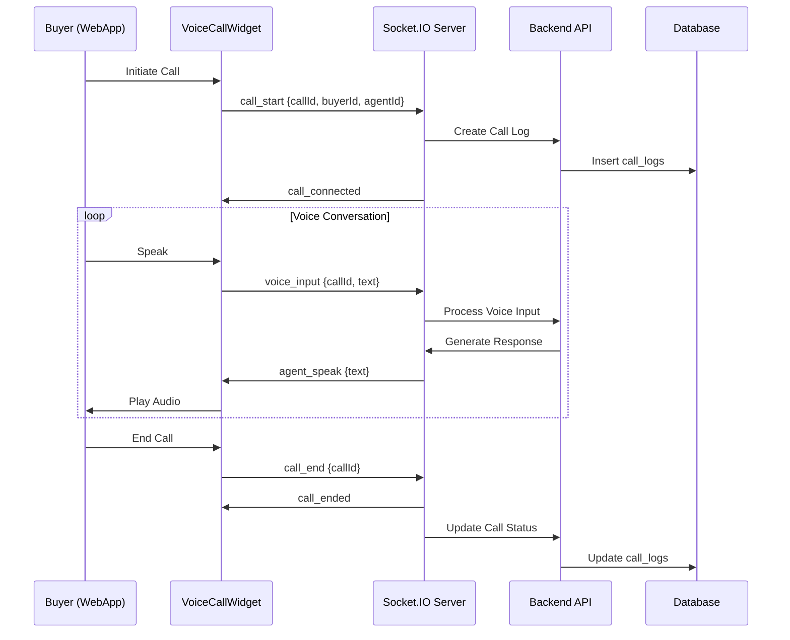
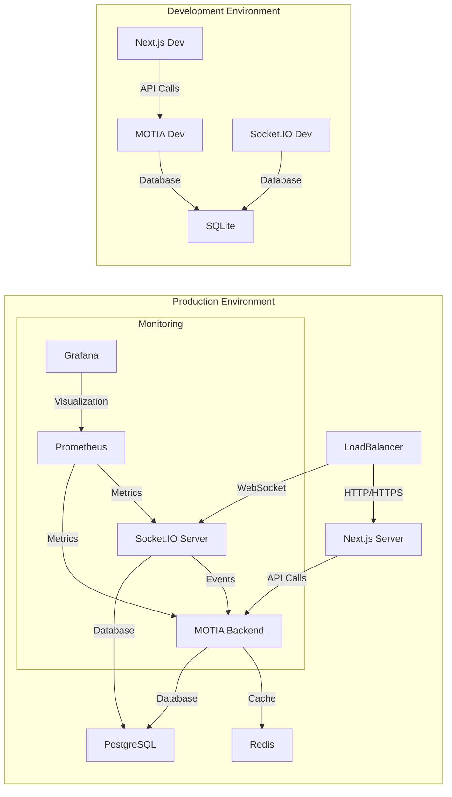

# PropertyHub System Architecture

## **Comprehensive System Architecture Diagram**

```mermaid
graph TD
    %% ============================================
    %% CLIENT LAYER
    %% ============================================
    subgraph ClientLayer[Client Layer]
        direction TB
        WebApp[Next.js Web Application] -->|HTTP| BackendAPI
        MobileApp[Mobile App - Future] -->|HTTP| BackendAPI
        
        WebApp -->|WebSocket| SocketServer
        MobileApp -->|WebSocket| SocketServer
        
        subgraph WebComponents[Web Components]
            AuthContext[Auth Context] -->|Manages| UserSession
            VoiceCallWidget[Voice Call Widget] -->|WebSocket| SocketServer
            PropertyGrid[Property Grid] -->|REST| BackendAPI
            CartSystem[Cart System] -->|REST| BackendAPI
            Dashboard[CRM Dashboard] -->|REST| BackendAPI
        end
    end

    %% ============================================
    %% BACKEND LAYER
    %% ============================================
    subgraph BackendLayer[Backend Layer]
        direction TB
        
        subgraph MOTIAFramework[MOTIA Framework]
            BackendAPI[REST API Endpoints] -->|Drizzle ORM| Database
            BackendAPI -->|JWT Auth| AuthService
            BackendAPI -->|Validation| ZodValidation
            
            subgraph APIEndpoints[API Endpoints]
                AuthAPI[Authentication API] -->|JWT| AuthService
                PropertiesAPI[Properties API] -->|CRUD| Database
                CartAPI[Cart API] -->|CRUD| Database
                CRMAPI[CRM API] -->|CRUD| Database
                AIAgentsAPI[AI Agents API] -->|CRUD| Database
                CallsAPI[Calls API] -->|CRUD| Database
                SubscriptionsAPI[Subscriptions API] -->|CRUD| Database
                AnalyticsAPI[Analytics API] -->|CRUD| Database
            end
        end
        
        SocketServer[Socket.IO Server] -->|Real-time| CallSessions
        SocketServer -->|Events| BackendAPI
        
        subgraph Services[Backend Services]
            AuthService[JWT Authentication] -->|Verify| Database
            SocketServer -->|Call Management| CallSessions
            VoiceBridge[Voice Bridge] -->|Process| CallSessions
            MockPayment[Mock Payment Service] -->|Process| Database
        end
    end

    %% ============================================
    %% DATABASE LAYER
    %% ============================================
    subgraph DatabaseLayer[Database Layer]
        direction TB
        Database[SQLite/PostgreSQL] -->|Drizzle ORM| Schema
        
        subgraph Schema[Database Schema]
            UsersTable[users] -->|1:N| PropertiesTable
            UsersTable -->|1:N| CartTable
            UsersTable -->|1:N| LeadsTable
            UsersTable -->|1:N| AgentAssignments
            UsersTable -->|1:N| AiAgentsTable
            UsersTable -->|1:N| SubscriptionsTable
            UsersTable -->|1:N| TransactionsTable
            UsersTable -->|1:N| CallLogsTable
            
            PropertiesTable[properties] -->|1:N| CartTable
            PropertiesTable -->|1:N| LeadsTable
            
            AiAgentsTable[ai_agents] -->|1:N| SubscriptionsTable
            AiAgentsTable -->|1:N| CallLogsTable
            
            SubscriptionsTable[subscriptions] -->|1:N| TransactionsTable
            
            CallLogsTable[call_logs] -->|1:N| Transcripts
        end
        
        CallSessions[Active Call Sessions] -->|In-Memory| SocketServer
    end

    %% ============================================
    %% EXTERNAL SERVICES
    %% ============================================
    subgraph ExternalServices[External Services]
        direction TB
        Stripe[Stripe Payment Gateway] -->|Future| MockPayment
        ElevenLabs[ElevenLabs TTS] -->|Future| VoiceBridge
        GoogleTTS[Google TTS] -->|Future| VoiceBridge
        GoogleMaps[Google Maps API] -->|Future| PropertiesAPI
        Elasticsearch[Elasticsearch] -->|Future| PropertiesAPI
    end

    %% ============================================
    %% DATA FLOW CONNECTIONS
    %% ============================================
    WebApp -->|1. User Registration| AuthAPI
    WebApp -->|2. Property Search| PropertiesAPI
    WebApp -->|3. Add to Cart| CartAPI
    WebApp -->|4. Hire AI Agent| AIAgentsAPI
    WebApp -->|5. Start Voice Call| CallsAPI
    
    CallsAPI -->|6. Create Call Log| Database
    SocketServer -->|7. Real-time Events| VoiceCallWidget
    VoiceBridge -->|8. Process Voice Input| SocketServer
    
    %% WebSocket Events
    VoiceCallWidget -->|call_start| SocketServer
    VoiceCallWidget -->|voice_input| SocketServer
    VoiceCallWidget -->|call_end| SocketServer
    
    SocketServer -->|call_connected| VoiceCallWidget
    SocketServer -->|agent_speak| VoiceCallWidget
    SocketServer -->|call_ended| VoiceCallWidget

    %% ============================================
    %% STYLES
    %% ============================================
    style ClientLayer fill:#f9f9f9,stroke:#333,stroke-width:2px
    style BackendLayer fill:#f0f8ff,stroke:#333,stroke-width:2px
    style DatabaseLayer fill:#fff0f0,stroke:#333,stroke-width:2px
    style ExternalServices fill:#f0fff0,stroke:#333,stroke-width:2px
    
    style WebApp fill:#e6f7ff,stroke:#4da6ff
    style MobileApp fill:#e6f7ff,stroke:#4da6ff
    style BackendAPI fill:#fff2e6,stroke:#ffa940
    style SocketServer fill:#f0fff4,stroke:#7cb342
    style Database fill:#fff0e6,stroke:#ff8c00
```



## **Detailed Architecture Breakdown**

### **1. Client Layer Architecture**

#### **Next.js Web Application**
- **Framework**: Next.js 16.1.1 with React 19.2.3
- **UI**: TailwindCSS with Framer Motion for animations
- **State Management**:
  - `AuthContext`: JWT-based authentication state
  - `ToastContext`: Notification management
  - WebSocket client for real-time voice calls
- **Key Components**:
  - `VoiceCallWidget`: Real-time voice call interface with WebSocket integration
  - `PropertyGrid`: Property listing and search interface
  - `CartSystem`: Buyer's property shortlist management
  - `Dashboard`: Seller CRM with analytics

#### **Mobile App (Future)**
- Planned React Native implementation
- Same API and WebSocket interfaces as web app

### **2. Backend Layer Architecture**

#### **MOTIA Framework**
- **Type**: Node.js-based framework
- **Language**: TypeScript
- **Key Features**:
  - RESTful API design with Zod validation
  - Event-driven architecture with topic-based emits
  - Integrated with Drizzle ORM for database operations

#### **API Endpoints (24+ RESTful endpoints)**

**Authentication API** (`/api/auth`)
- `POST /register`: User registration with role validation
- `POST /login`: JWT-based authentication

**Properties API** (`/api/properties`)
- `GET /`: Property search with advanced filters
- `POST /`: Create property listing
- `GET /:id`: Get property details

**Cart API** (`/api/cart`)
- `POST /`: Add property to cart
- `GET /`: Get cart items
- `DELETE /:id`: Remove from cart

**CRM API** (`/api/crm`)
- `POST /agents`: Hire human agents
- `GET /agents`: List agent assignments

**AI Agents API** (`/api/ai-agents`)
- `GET /`: List AI agents
- `POST /`: Create AI agent
- `PUT /:id`: Update AI agent
- `DELETE /:id`: Delete AI agent
- `POST /hire`: Hire AI agent with subscription
- `POST /:id/terminate`: Terminate AI agent subscription

**Calls API** (`/api/calls`)
- `POST /start`: Start voice call
- `POST /process`: Process voice input
- `POST /end`: End voice call
- `GET /`: List active calls

**Subscriptions API** (`/api/subscriptions`)
- `GET /`: List subscriptions

**Transactions API** (`/api/transactions`)
- `GET /`: List transactions

**Analytics API** (`/api/analytics`)
- `GET /`: Get seller analytics

#### **WebSocket Server (Socket.IO)**
- **Port**: 3002
- **Namespace**: `/calls`
- **Events**:
  - `call_start`: Initiate voice call
  - `voice_input`: Send buyer voice input
  - `agent_response`: Receive agent response
  - `call_end`: Terminate call
  - `call_connected`: Call established
  - `agent_speak`: Agent speaking
  - `call_ended`: Call terminated

#### **Backend Services**
- **JWT Authentication**: Token-based auth with role validation
- **Voice Bridge**: Processes voice input and routes to appropriate handlers
- **Mock Payment Service**: Simulates payment processing (to be replaced with Stripe)
- **Call Session Management**: In-memory storage of active calls

### **3. Database Layer Architecture**

#### **Database Schema (10 Tables)**

**Core Tables**
- `users`: User accounts with roles (buyer, seller, agent)
- `properties`: Property listings with metadata
- `carts`: Buyer's property shortlist
- `leads`: Buyer inquiries and lead tracking

**Agent Management Tables**
- `agent_assignments`: Human agent assignments to sellers
- `ai_agents`: AI agent configurations with voice settings
- `subscriptions`: Agent subscriptions (AI/human) with billing cycles
- `transactions`: Payment events and refunds

**Call Management Tables**
- `call_logs`: Voice call records with transcripts

#### **Key Relationships**
- Users → Properties (1:N)
- Users → Cart Items (1:N)
- Users → Leads (1:N)
- Users → Agent Assignments (1:N)
- Users → AI Agents (1:N)
- Users → Subscriptions (1:N)
- Users → Transactions (1:N)
- Users → Call Logs (1:N)
- Properties → Cart Items (1:N)
- Properties → Leads (1:N)
- AI Agents → Subscriptions (1:N)
- AI Agents → Call Logs (1:N)
- Subscriptions → Transactions (1:N)

### **4. Real-time Communication Flow**



### **5. Data Flow Architecture**

#### **User Authentication Flow**
```
1. User submits credentials → Frontend
2. Frontend → POST /api/auth/login → Backend
3. Backend validates → JWT token generated
4. Token stored in localStorage → AuthContext updated
5. Subsequent requests include Authorization header
```

#### **Property Listing Flow**
```
1. Seller submits property → Frontend form
2. Frontend → POST /api/properties → Backend
3. Backend validates with Zod → Database insert
4. Property stored → Response with property data
5. Frontend displays confirmation
```

#### **AI Agent Hiring Flow**
```
1. Seller selects AI agent → Frontend
2. Frontend → POST /api/ai-agents/hire → Backend
3. Backend validates subscription → Mock payment processing
4. Subscription created → AI agent activated
5. Frontend shows success → Agent ready for calls
```

#### **Voice Call Flow**
```
1. Buyer clicks "Call Agent" → Frontend
2. Frontend → POST /api/calls/start → Backend
3. Backend creates call log → Returns socket info
4. Frontend connects to Socket.IO → call_start event
5. Socket server creates session → call_connected
6. Buyer speaks → voice_input event
7. Socket server processes → agent_response
8. Frontend plays audio → Real-time conversation
9. Call ends → call_end event → Session terminated
```

### **6. Technology Stack**

#### **Frontend**
- **Framework**: Next.js 16.1.1
- **Language**: TypeScript
- **UI**: TailwindCSS, Framer Motion
- **State**: React Context API
- **Real-time**: Socket.IO Client
- **Icons**: Lucide React

#### **Backend**
- **Framework**: MOTIA (Node.js-based)
- **Language**: TypeScript
- **Database**: SQLite (dev) / PostgreSQL (prod)
- **ORM**: Drizzle ORM
- **Validation**: Zod
- **Real-time**: Socket.IO Server
- **Auth**: JWT

#### **Database**
- **Current**: SQLite with Drizzle ORM
- **Production**: PostgreSQL planned
- **Schema**: 10 tables with proper relationships
- **Migrations**: Drizzle Kit

#### **External Services (Planned)**
- **Payments**: Stripe
- **TTS/STT**: ElevenLabs, Google TTS
- **Maps**: Google Maps API
- **Search**: Elasticsearch
- **Storage**: AWS S3

### **7. Deployment Architecture**



### **8. Security Architecture**

#### **Authentication**
- JWT-based authentication with role validation
- Token expiration and refresh mechanisms
- Secure storage in localStorage

#### **Authorization**
- Role-based access control (buyer, seller, agent)
- API endpoint validation
- Resource ownership verification

#### **Data Protection**
- HTTPS for all communications
- Input validation with Zod
- SQL injection prevention via Drizzle ORM
- Rate limiting (planned)

#### **WebSocket Security**
- CORS restrictions
- Authentication middleware
- Session validation
- Rate limiting (planned)

### **9. Performance Architecture**

#### **Caching Strategy**
- Redis caching for frequent queries (planned)
- Browser caching for static assets
- CDN for global content delivery (planned)

#### **Database Optimization**
- Indexes on frequently queried fields
- Connection pooling for PostgreSQL
- Query optimization with Drizzle

#### **Real-time Performance**
- WebSocket connection reuse
- Room-based message routing
- In-memory session management
- Batch processing for transcripts

### **10. Scalability Architecture**

#### **Horizontal Scaling**
- Stateless backend services
- Load-balanced API servers
- Multiple WebSocket servers with Redis pub/sub

#### **Database Scaling**
- Read replicas for analytics
- Connection pooling
- Query optimization

#### **Microservices Strategy**
- Separate API and WebSocket services
- Independent scaling
- Service discovery

## **Key Architectural Decisions**

### **1. MOTIA Framework Selection**
- **Rationale**: Rapid development with built-in event system
- **Benefits**: TypeScript support, Drizzle ORM integration, event-driven architecture
- **Trade-offs**: Vendor lock-in, learning curve

### **2. WebSocket-based Voice CRM**
- **Rationale**: Real-time communication requirements
- **Benefits**: Low latency, persistent connections, bidirectional communication
- **Trade-offs**: Complexity in session management, scaling challenges

### **3. Unified Agent Management**
- **Rationale**: Simplify AI and human agent management
- **Benefits**: Single interface, consistent data model, easier maintenance
- **Trade-offs**: Additional complexity in agent type handling

### **4. Subscription-based Monetization**
- **Rationale**: Recurring revenue model
- **Benefits**: Predictable income, customer retention, tiered pricing
- **Trade-offs**: Complex billing logic, refund management

### **5. Event-driven Architecture**
- **Rationale**: Decoupled components, scalability
- **Benefits**: Easy to extend, real-time processing, better separation of concerns
- **Trade-offs**: Debugging complexity, event ordering challenges

## **Future Architecture Evolution**

### **Phase 1: Production Readiness**
- Database migration to PostgreSQL
- Real payment integration (Stripe)
- Voice provider integration (ElevenLabs/Google TTS)
- Production monitoring and logging

### **Phase 2: Scalability Enhancements**
- Redis caching implementation
- Load balancing for API servers
- Multiple WebSocket servers with Redis pub/sub
- CDN for static assets

### **Phase 3: Advanced Features**
- Elasticsearch integration for property search
- Google Maps API for location services
- AWS S3 for file storage
- Microservices decomposition

### **Phase 4: Enterprise Features**
- Multi-region deployment
- Advanced analytics pipeline
- Machine learning for recommendations
- AI-powered features

## **Conclusion**

The PropertyHub architecture represents a modern, scalable real estate platform with innovative AI-powered voice CRM capabilities. The system is built on a solid foundation of TypeScript, Next.js, and MOTIA framework, with a clear path for evolution to production readiness and enterprise-scale deployment.

The architecture successfully combines:
- Traditional RESTful APIs for data management
- Real-time WebSocket communication for voice calls
- Unified agent management for AI and human agents
- Subscription-based monetization model
- Event-driven processing for scalability

This comprehensive architecture provides the technical foundation for PropertyHub's unique value proposition in the real estate market.